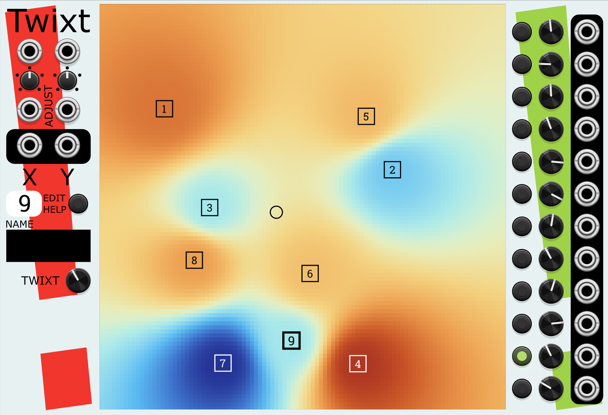
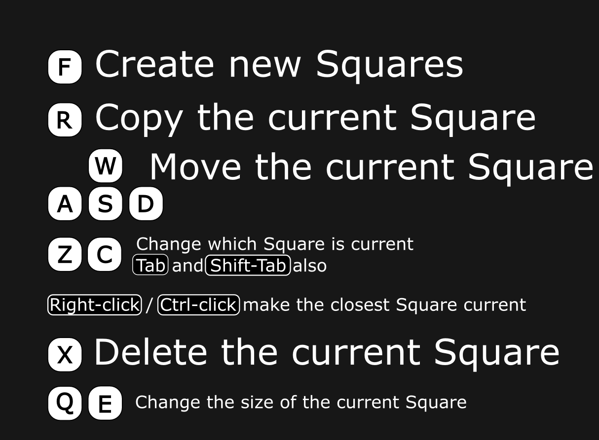
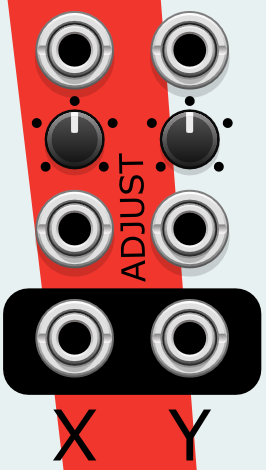
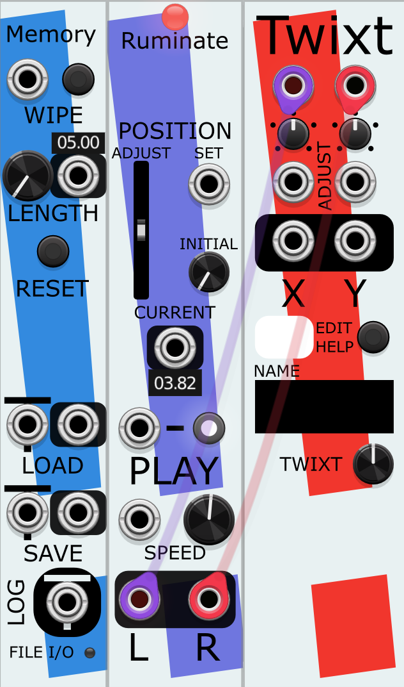
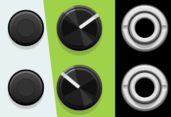
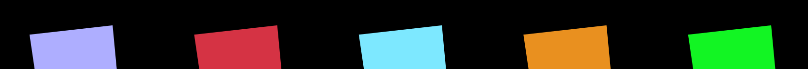
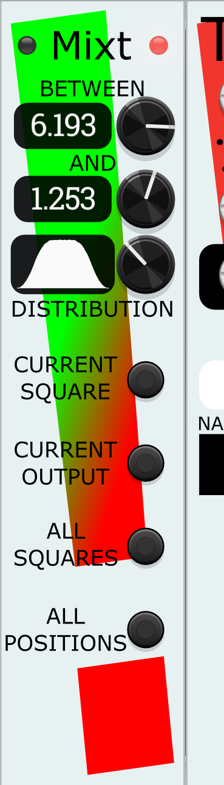

# Twixt, a CV signal controller module for VCV Rack

Twiddle twelve signals with a single click. Twixt is a signal generator for VCV Rack with twelve outputs.

Twixt is useful for exploring the sonic spaces between desired sonic points (the Squares). It also has unique randomization capabilities (with undo and redo) using the companion module [Mixt](#mixt) that make it delightful for sonic exploration. 

# Twixt
Twixt is a 2D graphical signal generator consisting of up to sixteen visible Squares,
each with 12 output values, and a visible Point chosen by mouse or CV.
Where the Point is in relation to the Squares (and their values) determines the 12 CV outputs.

Twixt's "making values between known sets of values" UI is inspired by Metasurface part of [AudioMulch](http://www.audiomulch.com/), a desktop music studio.

# Quick Start
If you just want a quick taste of what Twixt does:
* Take an existing patch of yours.
* Add a Twixt module.
* Randomize it with the menu.
* Attach some of the outputs to various CV control points in your patch (if they have attenuverters, make sure they aren't at zero).
* Start dragging the mouse around the surface.
* Try different values for the TWIXT knob.

### Videos
Short videos: [an early teaser](https://youtu.be/XVvhzCE7Hsk?si=nbeVQ3aMhPy6dM-O), [a slightly more informative one](https://youtu.be/WoRrLPeSNlc?si=_K4vIA7JKqTKTFfQ), [a vertical short](https://www.youtube.com/shorts/FhxLgaAo-Xw). Note that none of these feature the final design.

Feature videos: [moving Point](https://youtu.be/mH-AyvrwWUw).

### Uses
* **Access the sounds between other sounds.** When you have two or more distinct sonic qualities you want to explore for the same section of a patch (e.g., making the lead melody "clean" vs. "drenched in chorus and reverb" vs. "overdriven"):
* * Make each of those a Square.
* * Attach the outputs to the inputs of the modules that control those qualities.
* * Move the Point on top of each of the squares.
* * * Type in the name of Square.
* * * Adjust the output values that create that quality.
* * Pick a TWIXT value (e.g., Bilinear Squared), and drag the point around with the mouse to hear the sounds between the ones you created.

* **Graphically control the mix.**
* **Explore changing many properties of a patch at once.**

## Controls

### The Square Surface
The large black are in the center of Twixt is where the Squares and the Point reside.

#### Squares
Each Square has a number from 1 - 16. They can also have names, edited with the NAME edit field on the right side.

The Squares are created, resized, moved, and deleted with keystrokes. These are all centered
around the WASD keys familiar to anyone who has played games on a computer.

**You can show this help within Twixt by clicking the EDIT HELP button.**

These edits affect
whichever Square is currently **selected**; the currently selected Square is shown in slightly thicker lines, and its corresponding number is shown in a small white window to the left of the Surface (just above the NAME).

* Make new Squares:
* * **F** - create a brand new Square centered on where the mouse cursor is currently hovering over the surface. That new Square will now be the selected Square. All of its values will be zero.
* * **R** - copies the selected Square and places the copy centered on where the mouse cursor is currently hovering over the surface. If the original Square had a NAME, (e.g., "Spacey") then the new Square will have a similar name (e.g., "Copy of Spacey").
* Changing or moving the selected Square:
* * **W/A/S/D** - move the selected Square around the space.
* * **Q** - shrink the selected Square. Some settings of TWIXT take into account the relative sizes of the Squares when computing the values of the outputs.
* * **E** - enlarge the selected Square.
* Changing which Square is selected:
* * Right-clicking the mouse pointer on the Surface will make the nearest Square be the selected square.
* * **C/Z** or **TAB/SHIFT-TAB** - cycles through the Squares, selecting each in turn. **C** and **TAB** move to the next higher numbered Square, **Z** and **SHIFT-TAB** move to lower numbers, and both gestures wrap around from the last Square to the first.
* Remove Squares:
* * **X** - deletes the selected Square.

##### Square Names
Each Square can have a user-created name, which is shown underneath the Square's number. This can, for example, make it easier to see at a glance which Square corresponds to which sound quality. When a Square is selected, the current name for it is shown to the left of the Square Surface in an editable text window (NAME). Editing text there immediately updates the text seen on the display.

A couple of notes:
* While editing names, use **TAB** and **SHIFT-TAB** to rotate through the Squares.
* If the name of a Square is getting wider than you like, you can separate the name into multiple lines by typing a newline/Enter in the name.

#### EDIT HELP
Clicking this button will replace the colorful graphical display of the Surface and show the keyboard help.

### The Point
The Point is a small circle in the Surface that controls the signals sent by each of the twelve CV outputs along the right edge. The position of Point is a pair of X and Y voltages, where X = -5, Y = -5 is at the lower left corner and X = 5, Y = 5 is
at the upper right corner.

There are menu options on Twixt to change either or both of the X and Y axis from the [-5, 5] range to [0, 10].

The Point's position can be set (and moved) in a number of ways (see [this video for a demonstration](https://youtu.be/mH-AyvrwWUw)):
* Clicking or dragging on the surface will move the Point to that position.
* On the left side of Twixt, there are a number of controls to move Point: 
* * Inputs at the top for setting X and Y. If these are not set, then the last position set by clicking on the surface will be used.
* * Below that, inputs with attenuverters are added to the values from the inputs (or last clicked position). Note that, somewhat unusually, the attenuverters range from -200% to 200%.
* * And below that are outputs of the current position of Point. Note that you can use these to chain together multiple Twixt modules with the same movement; just connect the X & Y outputs of the first Twixt to the X & Y inputs of the second.
* Note that X and Y are independent of each other, meaning that you can, for example, use the inputs above to control the X position of Point, but control the Y solely by your mouse clicks on the Surface.

#### Movement Files
To make Point movements easier to create, Twixt includes some .WAV files that can be played with many VCV Rack sample players (including my own [Memory System](https://github.com/mahlenmorris/VCVRack/blob/main/Memory.md)). They are written to the folder **plugins-[your OS]\StochasticTelegraphTwixt\twixt-waves** underneath your Rack2 user folder. Play one in Memory and use the left and right outputs as signals to X and Y.

They currently include movement in a circle, a square, and a triangle. Playing these files slower, faster, reversed, amplified, and combining/mixing multiple playback heads or files can create interesting movements.

### TWIXT
There are currently five different methods Twixt can use to determine what values the Outputs have when not directly atop a Square. In mathematical terms, this determines how values are *interpolated* between the Squares,
or how values *morph* between one square and the next.  
This knob determines which method is to be used.

They are:
* **Bilinear Squared**
* **Bilinear Cubic**
* **Venetian Secret**
* **Tactical Map**
* **Nearest Square**

These methods are in order from most-to-least gradual changes in output values. In Nearest Square, the Outputs are simply set to the values of the closest Square. This can be handy if you want to quickly change from one square's setting to another without having to be particularly careful in your mouse clicking.

The display for whichever Output is selected will be different for each of these TWIXT settings, showing how they affect Output values.

Note that in the **Bilinear Squared** and **Bilinear Cubic** TWIXT settings, the relative **size** of each squares (which can be changed with "q" and "e") affect the amount of influence that Square's values have. Try Twixt's "Size Matters" preset to see an example of this.

### Outputs
On the right side of the Twixt module is twelve sets of controls, one for each output:

These controls are, from left to right:
* A button that selects that Output as the one to show in the Surface. This shows the Squares and the colors convey how the values of that Output change across the surface. See the Twixt menu for many options for changing the colors and other aspects of this display.
* A knob showing the current value for this Output for the selected Square. Changing this value will change the value of this output at the currently selected Square. It may also affect (more gradually) the value of the output throughout the Surface; this effect depends on the TWIXT method.
* The output port itself.

### Menu Options
#### Randomize
The standard VCV Randomize menu option found on every module will, in Twixt, also replace any existing Squares with a random set of new ones. The Squares will also have randomly generated names and random Output values from -10 to 10.

For **vastly** more tunable and useful randomization of Twixt, see the companion [Mixt](#mixt) module.
#### Point position X ranges from 0-10 instead of -5 - 5
When set, the X input will be expected from 0-10, and the X output will fall into that range as well.
#### Point position Y ranges from 0-10 instead of -5 - 5
When set, the Y input will be expected from 0-10, and the Y output will fall into that range as well.
#### Color Scheme
A set of color schemes for the Surface display. Color Schemes have no effect on the Output values, they just
illustrate the interpolation of values for the viewer.

A few of them deserve further explanation:
* **VCV Cable Ports** duplicates the coloring that VCV cable heads show when carrying a particular voltage.
* **Distant Dawn** is esigned to only include colors that remain discernable for people with many forms of color blindness.
* **White Stripes** highlights even small variations in Output voltages.
* **Anonymous Zebra** also highlights small variations in Output voltages and is enjoyably cryptic and stripey. Try the "Ahhhh my eyes" preset as an example.

#### Range of color scheme
By default, the color scheme assigns color to voltages with the assumption that -10V to 10V is the full range. It's not unusual, though, to have Outputs with a small range of voltages, such as only from 0V to 10V, or even far smaller, and this can make the Surface's display less informative.  Here you can set the range as you wish.

As above, this will have no effect on the Outputs, this only affects the display.

#### Brightness
You can dim the Display an arbitrary amount with this control. If the Twixt display is harshing your 2AM-patching-in-the-dark vibe, here's your solution.

#### Show squares and names
Sometimes the Surface is more enjoyable to use or look at without the Squares being drawn.

### Bypass Behavior
If this module is bypassed, then all output values will be 0.0V. However, you can continue to
edit the Surface, adding and changing Squares as you wish.

### Related Modules
stoermelder's [TRANSIT](https://library.vcvrack.com/Stoermelder-P1/Transit) also does morphing from one set of knob values to another. It has the advantage of being able to directly control the knobs and switches of other modules.

# Mixt
Mixt is a companion module to Twixt, allowing you to more easily set random Output values for a single Square, a single Output across all Squares, or all Outputs on all Squares.

By placing Mixt next to your Twixt module, you gain access to more tunable randomization and the ability to explore different variations while taking advantage of VCV Rack's built-in Undo/Redo history.

Once you've gotten your Twixt module's Outputs the way you want them, you can remove the Mixt module.

## Use Example
* Place a Mixt module directly next to your Twixt module (the appropriate connection light at the top will illuminate).
* Select a Square in Twixt.
* On Mixt, adjust the Upper and Lower limits (e.g., 0V to 5V).
* Use the DISTRIBUTION knob to select the how you want values to be chosen. 
* Click the **CURRENT SQUARE** button to randomize the values of the current Square. The Output knobs for that Square will instant;y change.
* Listen to the new output. If you don't like it, press **Ctrl+Z** (Undo) to instantly revert.
* Try turning the DISTRIBUTION knob to shape the probability curve, then click **CURRENT SQUARE** button again and see how the values come out.

## Uses
* **Dial in more useful randomizations.** Twixt's built-in randomization sets outputs anywhere from -10V to 10V. If an Output is being used in a was that only sounds good when the outputs stay between 0V and 5V, use Mixt to randomize the Output to that range, and use DISTRIBUTE to affect how those values are chosen.
* **Targeted parameter shuffling.** Randomize just the positions of your squares while leaving their values intact, or randomize a single CV output across your entire surface more quickly than moving through each Square.
* **Set all Outputs to a single value.** At the lowest value of DISTRIBUTION, it will set all values it randomizes to the average of the two limits. For example, set both limits to 2.25, pick the lowest DISTRIBUTION value, and whatever you now randomize will all be set to 2.25. Note that the highest value of DISTRIBUTE will only set values to one or the other of the two limits. 

## Controls

### Connection Lights
At the top left and right of the module, two lights indicate whether Mixt has successfully linked to an adjacent Twixt module.

### Limits & Distribution
These knobs define the pool of random values that will be generated.
* **Upper & Lower Limits:** Set the absolute maximum and minimum voltages for the randomized outputs. The precise values are shown on the numeric displays. (Note: Mixt will automatically correct the logic if you set the lower limit higher than the upper limit).
* **Distribution:** Shapes the probability density function (PDF) curve of the random values. The curve is visually represented on the little display, allowing you to bias the random results in a number of useful ways.

Example DISTRIBUTION settings.
* 0 -> A single value that is the average of the two limits.
* 1 -> A bell curve or Gaussian distribution, favoring values in the middle.
* 2 -> A uniform distribution, equally likely to pick any value between the limits.
* 3 -> An inverted Gaussian, picking nothing in the middle.
* 4 -> Only picks the two limit values.

Note that any value between these integer values for DISTRIBUTION are also valid. Here are DISTRIBUTION settings at 0.5, 1.5, 2.5, and 3.5.

### Randomize Actions
Four buttons trigger immediate randomizations in adjacent Twixt modules based on your Limits and Distribution settings. 
* **Current Square** randomizes all 12 output values of the Square currently selected in Twixt.
* **Current Output** randomizes the value of the currently selected Output (CV 1-12) across *all* Squares in Twixt.
* **All Squares** randomizes all 12 output values for *every* Square on the Twixt surface.

And also:

* **All Positions** randomizes the X and Y positions of all Squares on the Twixt surface, but does not change the Output values for any Squares. The DISTRIBUTION has no effect on this operation.

# Acknowledgements

Thanks foremost to @paradiddle16 on the VCV Rack Community board for mentioning
AudioMulch's Metasurface. Twixt is my attempt to bring that interaction to Rack. 

Many thanks to [Marc Weidenbaum](https://disquiet.com/) for his
encouragement and enthusiasm for my module-making efforts.

And my deepest gratitude to Diane LeVan, for letting me ignore her and/or
the world for periods of time just to craft these things. I apologize for
waking up with new ideas at 5AM, and for having a retirement hobby that
is nearly impossible to even *start* describing to any of our friends.
